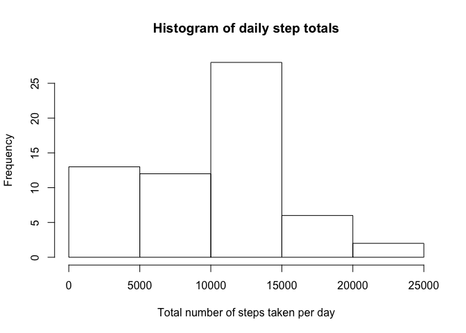
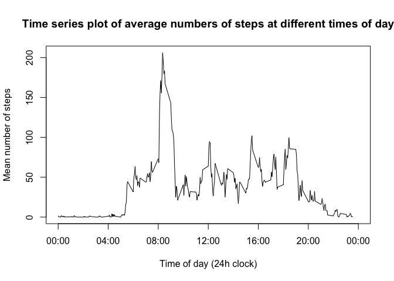

# Reproducible Research: Peer Assessment 1

## Loading and preprocessing the data

The data is in a zipped csv file. We need to unzip and read in the file.
The "date" variable is in character format, and would be more useful if it was converted to a date format.  We add this as an additional column.


```r
rawdata <- read.csv(unzip("activity.zip"))
rawdata$posixDate <- strptime(rawdata$date,"%Y-%m-%d")
```

## What is mean total number of steps taken per day?

### Calculating the total steps per day


```r
daysum <- tapply(rawdata$steps, rawdata$date, sum, na.rm=T)
```

The resulting sums for each day are 0, 126, 11352, 12116, 13294, 15420, 11015, 0, 12811, 9900, 10304, 17382, 12426, 15098, 10139, 15084, 13452, 10056, 11829, 10395, 8821, 13460, 8918, 8355, 2492, 6778, 10119, 11458, 5018, 9819, 15414, 0, 10600, 10571, 0, 10439, 8334, 12883, 3219, 0, 0, 12608, 10765, 7336, 0, 41, 5441, 14339, 15110, 8841, 4472, 12787, 20427, 21194, 14478, 11834, 11162, 13646, 10183, 7047, 0

### Histogram


```r
hist(daysum, xlab="Total number of steps taken per day",main="Histogram of daily step totals")
```

 

### Mean and median of total daily steps


```r
meansteps <- mean(daysum)
medsteps <- median(daysum)
```

The mean number of steps per day is 9354.2295082 steps, and the median is 10395 steps.

## What is the average daily activity pattern?

### Time series plot


```r
intervalmean <- tapply(rawdata$steps, rawdata$interval, mean, na.rm=T)
plot(unique(rawdata$interval),intervalmean,type='l',
     xlab="Time of day (24h clock)",ylab="Mean number of steps",
     main="Time series plot of average numbers of steps at different times of day",
     xlim=c(0,2400),xaxt="n") # suppress x axis to allow custom axis
# custom axis with 24 hour clock labels
axis(1,at=c(0,400,800,1200,1600,2000,2400),
     labels=c("00:00","04:00","08:00","12:00","16:00","20:00","00:00")) 
```

 

### Interval with maximum steps


```r
maxstepsint <- which(intervalmean==max(intervalmean))
# the answer has a variable name corresponding to the interval
maxintname <- names(maxstepsint)
```

The interval containing the maximum number of steps is 835.

## Imputing missing values

### Number of missing values


```r
stepnas <- sum(is.na(rawdata$steps))
datenas <- sum(is.na(rawdata$date))
intervalnas <- sum(is.na(rawdata$interval))
```

The number of NAs in the dates is 0, and the number in the intervals is 0.  The number of NAs in the step counts is 2304, so this is the number of rows containing missing values.

### Imputing missing values

I plan to use stochastic imputation.  For each 5 minute interval with missing data, I will calculate the mean and standard deviation of the data within that interval, and then select a random value from a normal distribution.  I will set the seed, so that each time the code is run, I will get the same results.


```r
set.seed(42)
```

### New dataset with imputed values

Create a new dataset that is equal to the original dataset but with the missing data filled in.

### Results with imputed values

Make a histogram of the total number of steps taken each day and Calculate and report the mean and median total number of steps taken per day. Do these values differ from the estimates from the first part of the assignment? What is the impact of imputing missing data on the estimates of the total daily number of steps?

## Are there differences in activity patterns between weekdays and weekends?

For this part the weekdays() function may be of some help here. Use the dataset with the filled-in missing values for this part.

### Create factor for weekday and weekend

Create a new factor variable in the dataset with two levels – “weekday” and “weekend” indicating whether a given date is a weekday or weekend day.

### Panel plot comparing weekdays to weekends

Make a panel plot containing a time series plot (i.e. type = "l") of the 5-minute interval (x-axis) and the average number of steps taken, averaged across all weekday days or weekend days (y-axis). See the README file in the GitHub repository to see an example of what this plot should look like using simulated data.
