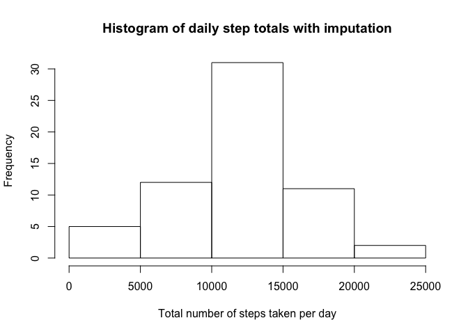
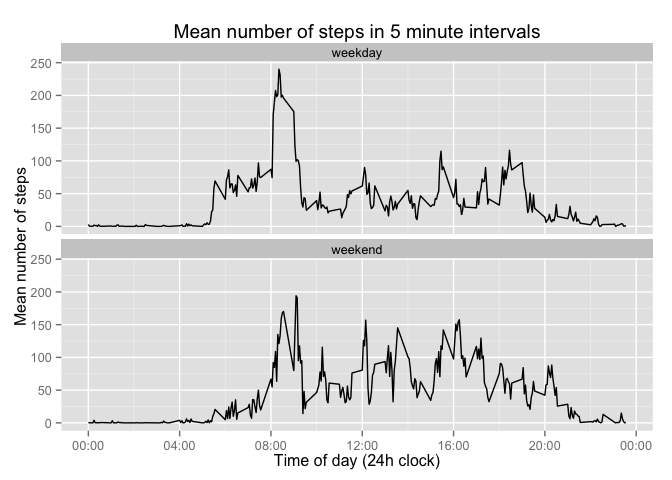

# Reproducible Research: Peer Assessment 1

## Loading and preprocessing the data

The data is in a zipped csv file. We need to unzip and read in the file.
The "date" variable is in character format, and would be more useful if it was converted to a date format.  We add this as an additional column.


```r
rawdata <- read.csv(unzip("activity.zip"))
rawdata$posixDate <- strptime(rawdata$date,"%Y-%m-%d")
```

## What is mean total number of steps taken per day?

### Calculating the total steps per day


```r
daysum <- tapply(rawdata$steps, rawdata$date, sum, na.rm=T)
```

The resulting sums for each day are 0, 126, 11352, 12116, 13294, 15420, 11015, 0, 12811, 9900, 10304, 17382, 12426, 15098, 10139, 15084, 13452, 10056, 11829, 10395, 8821, 13460, 8918, 8355, 2492, 6778, 10119, 11458, 5018, 9819, 15414, 0, 10600, 10571, 0, 10439, 8334, 12883, 3219, 0, 0, 12608, 10765, 7336, 0, 41, 5441, 14339, 15110, 8841, 4472, 12787, 20427, 21194, 14478, 11834, 11162, 13646, 10183, 7047, 0

### Histogram


```r
hist(daysum, xlab="Total number of steps taken per day",main="Histogram of daily step totals")
```

 

### Mean and median of total daily steps


```r
meansteps <- mean(daysum)
medsteps <- median(daysum)
```

The mean number of steps per day is 9354.2295082 steps, and the median is 10395 steps.

## What is the average daily activity pattern?

### Time series plot


```r
intervalmean <- tapply(rawdata$steps, rawdata$interval, mean, na.rm=T)
plot(unique(rawdata$interval),intervalmean,type='l',
     xlab="Time of day (24h clock)",ylab="Mean number of steps",
     main="Time series plot of average numbers of steps at different times of day",
     xlim=c(0,2400),xaxt="n") # suppress x axis to allow custom axis
# custom axis with 24 hour clock labels
axis(1,at=c(0,400,800,1200,1600,2000,2400),
     labels=c("00:00","04:00","08:00","12:00","16:00","20:00","00:00")) 
```

 

### Interval with maximum steps


```r
maxstepsint <- which(intervalmean==max(intervalmean))
# the answer has a variable name corresponding to the interval
maxintname <- names(maxstepsint)
```

The interval containing the maximum number of steps is 835.

## Imputing missing values

### Number of missing values


```r
stepnas <- sum(is.na(rawdata$steps))
datenas <- sum(is.na(rawdata$date))
intervalnas <- sum(is.na(rawdata$interval))
```

The number of NAs in the dates is 0, and the number in the intervals is 0.  The number of NAs in the step counts is 2304, so this is the number of rows containing missing values.

### Imputing missing values

I plan to use stochastic imputation.  For each 5 minute interval with missing data, I will calculate the mean and standard deviation of the data within that interval, and then select a random value from a normal distribution.  If the random result is negative, I will report zero as the number of steps.  I will set the seed, so that each time the code is run, I will get the same results.


```r
set.seed(42)
# function for imputation: random value from normal, or 0 if value is negative
myimputation <- function(mu,sigma) { 
  r <- rnorm(1,mu,sigma)
  if(r<0) r=0
  r
}

# sds for each interval
intervalstd <- tapply(rawdata$steps, rawdata$interval, sd, na.rm=T)

# create new dataset
imputeddata <- rawdata

# missing values and corresponding means and sds
missing <- which(is.na(rawdata$steps))
missingints <- rawdata$interval[missing]
missingmeans <- intervalmean[as.character(missingints)]
missingstds <- intervalstd[as.character(missingints)]

# imputation!
imputed <- mapply(myimputation,missingmeans,missingstds)

# insert into dataset
imputeddata$steps[missing] <- imputed
```

### Results with imputed values


```r
newdaysum <- tapply(imputeddata$steps, imputeddata$date, sum, na.rm=T)
hist(newdaysum, xlab="Total number of steps taken per day",main="Histogram of daily step totals with imputation")
```

 

```r
newmeansteps <- mean(newdaysum)
newmedsteps <- median(newdaysum)
```

The mean number of steps per day after imputation is 11452.72 steps, and the median is 11458 steps.

As missing data on number of steps was not included in the original totals without imputation, the imputed data tends to increase the total number of steps for days which had missing data.  Therefore the histogram is shifted to the right, and both the mean and median have increased.

## Are there differences in activity patterns between weekdays and weekends?

### Create factor for weekday and weekend


```r
typeofday <- function(dates) {
  wkday <- weekdays(dates)
  res <- rep("weekday",length(dates))
  res[wkday=="Saturday"] <- "weekend"
  res[wkday=="Sunday"] <- "weekend"
  res
}

imputeddata$daytype <- factor(typeofday(imputeddata$posixDate))
```

### Panel plot comparing weekdays to weekends


```r
library(dplyr)
```

```
## 
## Attaching package: 'dplyr'
## 
## The following objects are masked from 'package:stats':
## 
##     filter, lag
## 
## The following objects are masked from 'package:base':
## 
##     intersect, setdiff, setequal, union
```

```r
paneldata <- imputeddata[c("interval","steps","daytype")]
averagesteps <- paneldata %>% group_by(interval,daytype) %>% summarise(avsteps=mean(steps))

library(ggplot2)
panplot <- ggplot(averagesteps, aes(interval,avsteps))
panplot <- panplot + geom_line() + facet_wrap(~daytype,ncol=1) 
panplot <- panplot + scale_x_continuous(breaks=c(0,400,800,1200,1600,2000,2400),
     labels=c("00:00","04:00","08:00","12:00","16:00","20:00","00:00"))
panplot <- panplot + xlab("Time of day (24h clock)") + ylab("Mean number of steps")
panplot <- panplot + ggtitle("Mean number of steps in 5 minute intervals")
print(panplot)
```

 

